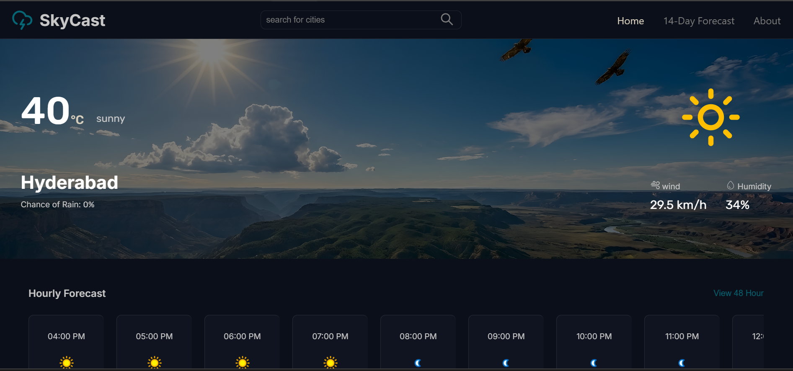
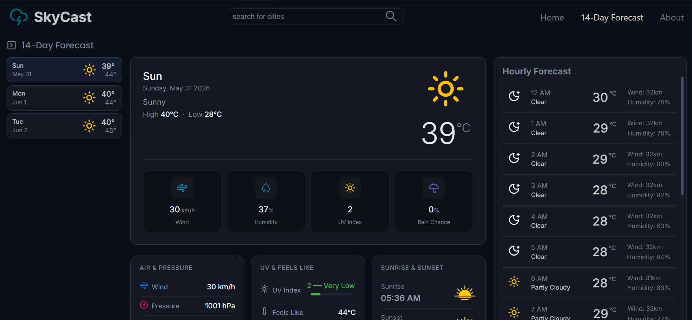
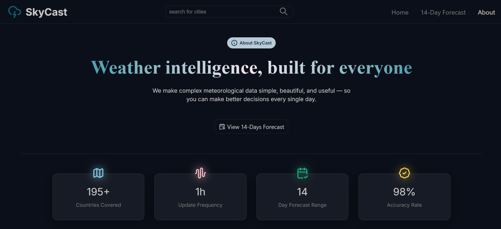

# SkyCast-Website

> SkyCast is a weather forecasting web application offering real-time and extended weather updates with a responsive, user-friendly interface.


## Overview

SkyCast provides up-to-date weather information, including current conditions, hourly forecasts, and a 14-day outlook. The application features a visually appealing and responsive interface, enhanced with dynamic backgrounds tailored to various weather conditions. Built entirely with HTML, CSS, and JavaScript, SkyCast is easy to use and accessible on both desktop and mobile devices.

## Tech Stack

- **HTML** — Structure and layout
- **CSS** — Styling and responsive design
- **JavaScript** — Weather data handling and UI interactivity

## Prerequisites

- Modern web browser (Chrome, Firefox, Edge, Safari, etc.)
- No additional runtime or dependencies required

## Installation

SkyCast is a static web application. To install and run locally:

1. **Clone the repository**
   ```bash
   git clone https://github.com/ramishajamshaid/SkyCast-Website.git
   cd SkyCast-Website
   ```
2. **Open the app**
   - Double-click `index.html` or open it in your preferred web browser.

## Usage

1. Launch `index.html` in your browser.
2. Use the toggle component (located in `/components/toggle.html`) to switch views or settings.
3. View current weather information on the main page.
4. Navigate to `forecast.html` for extended 14-day weather forecasts.
5. Experience dynamic background changes reflecting weather conditions.
6. Refresh the page to update weather data.

## Screenshots

This section includes screenshots of the SkyCast web application, showing the Home page with current weather details, the 14-day forecast page, and the About page. These visuals demonstrate the overall UI design and functionality of the project.

### Home Page


### 14-Day Forecast


### About Page


---

## Project Structure

```
SkyCast-Website/
│
├── .vscode/
│   └── settings.json         # Editor configuration
├── README.md                 # Project documentation
├── about.html                # About page
├── components/
│   └── toggle.html           # Toggle switch component
├── forecast.html             # 14-day forecast view
├── images/
│   ├── brand-logo.png
│   ├── clear-night-bg.jpg
│   ├── cloud-night-bg.jpg
│   ├── cloudy-day-bg.jpg
│   ├── glassmorphism.jpeg
│   ├── glassmorphism1.jpg
│   ├── glassmorphism2.jpeg
│   ├── mist-day-bg.jpeg
│   ├── mist-night-bg.png
│   ├── rain-day-bg.png
│   ├── rainy-night-bg.png
│   ├── stormy-day-bg.jpg
│   ├── stormy-night-bg.jpg
│   ├── sunny-day-bg.png
│   ├── sunrise.png
│   └── sunset.png            # Weather-related images & backgrounds
├── index.html                # Main entry point
├── script.js                 # Core JavaScript functionality
└── styles.css                # App styling
```

## Contributing

Contributions are welcome! Please follow these steps:

1. **Fork** the repository
2. **Create** a feature branch
   ```bash
   git checkout -b your-feature
   ```
3. **Commit** your changes
4. **Push** to your branch
5. **Open** a Pull Request for review

## License

_No license specified._  
If you wish to use or contribute, please contact the repository owner for clarification.

---
[](https://www.readmeai.in)
